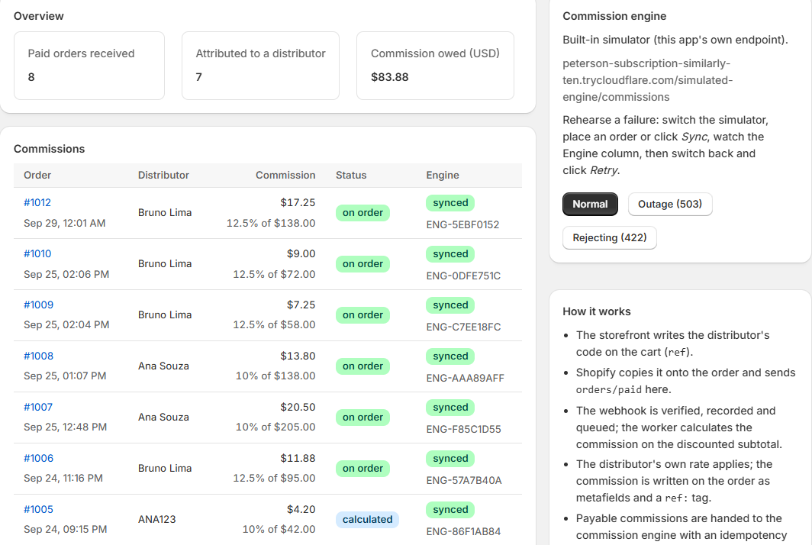

# Gabriel Randow

**Shopify developer, full stack** — six years on Shopify, four of them at a US agency shipping Shopify Plus stores and their integrations for DTC brands. I work on both sides of the platform: headless storefronts on the Storefront and Customer Account APIs, and custom apps that connect a store to the systems it depends on — Admin GraphQL API, webhooks, back-office integrations.

## Selected projects

- **[luma-commission-bridge](https://github.com/GRandow/luma-commission-bridge)** — custom app for direct-sales brands: `orders/paid` webhooks (HMAC-verified, idempotent by webhook id, queued with retries), distributors as metaobjects, the commission written back to the order, and a sync to a commission engine with idempotency keys and a rehearsable failure mode. TypeScript · React Router · Prisma/Postgres · Polaris · unit-tested, CI on every push.
- **[luma-shopify-storefront](https://github.com/GRandow/luma-shopify-storefront)** — headless storefront on the Storefront, Cart and Customer Account APIs (OAuth 2.0 + PKCE), with referral attribution for direct sales. React 19 · TypeScript · Vite · TanStack Query · unit-tested, CI. [Live demo](https://grandow.github.io/luma-shopify-storefront/)
- **[ecommerce-product-carousel](https://github.com/GRandow/ecommerce-product-carousel)** — dependency-free product carousel for e-commerce pages, vanilla JS + Tailwind. [Live demo](https://grandow.github.io/ecommerce-product-carousel/)

  

The commission bridge inside the Shopify admin: each paid order attributed, calculated at the distributor's rate and synced to the engine.

Next up: a Checkout UI extension and a Shopify Function for distributor pricing, inside the commission bridge.

## Certifications

11 official Shopify certifications, including Development Fundamentals, Liquid Storefronts and Headless for Developers.

## Contact

[LinkedIn](https://www.linkedin.com/in/gabriel-randow/) · Brazil (UTC−3) · used to working with North American teams
